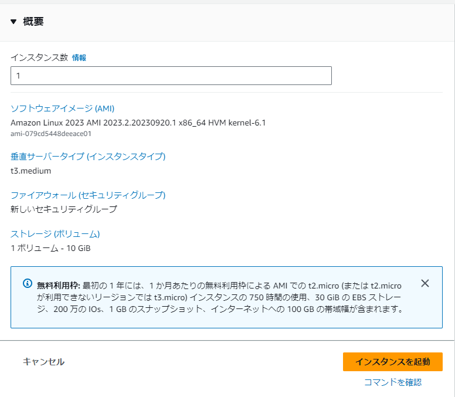
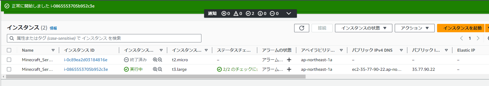

# 1.EC2インスタンス編
https://ap-northeast-1.console.aws.amazon.com/ec2/home?region=ap-northeast-1#Instances:

## 名前とタグ
- 『名前』:【Minecraft_Server】

  

## アプリケーションおよび OS イメージ (Amazon マシンイメージ)
- 『クイックスタート』:【Amazon Linux】
- 『Amazon マシンイメージ(AMI)』:【Amazon Linux 2 AMI (HVM) - Kernel 数字 SSD Volume Type】
- 『アーキテクチャ』:【64 ビット (x86)】

  

## インスタンスタイプ
- 『インスタンスタイプ』:【t3.large】

  

## キーペア(ログイン)
- 初回はキーペアを作成する
- 【新しいキーペアの作成】をクリック

  

- 『キーペア名』: [Minecraft-key]
- 『キーペアのタイプ』:【RSA】
- 『プライベートキーファイル形式』: 【.pem】

  

- 上記で作成したキーペアが記載されているかを確認

  

# ネットワーク設定

- 『VPC - 必須』:【Minecraft-vpc】
- 『サブネット』:【Minecraft-subnet-public1-ap-northeast-1a】
- 『パブリック IP の自動割り当て』:【有効化】

ファイアウォール(セキュリティグループ)
- 【セキュリティグループを作成する】を選択
- 『セキュリティグループ名 - 必須』: [Minecraft-SG]
  - 『説明 - 必須』: [Minecraft-SG]

  

ファイアウォール(セキュリティグループ)

- 【セキュリティグループを作成する】を選択
- 『セキュリティグループ名 - 必須』: [Minecraft-SG]
- 『説明 - 必須』: [Minecraft-SG]

セキュリティグループルール1
- ①『ソースタイプ』: 【自分の IP】
- ②【セキュリティグループルールを追加】をクリック

セキュリティグループルール 2
- ③『ポート範囲』: [25565]
- ④『ソースタイプ』:【任意の場所】

# ストレージを設定
[10] と入力し､【gp3】を選択します｡

# 概要
『インスタンス数』が [1] となっている事を確認し､【インスタンスを起動】をクリックします｡

- 画面上部にて､『成功』と表示されていることを確認し､その後に【すべてのインスタンスを表示】をクリックします｡

- ※t3.midiumで起動すると動きません

